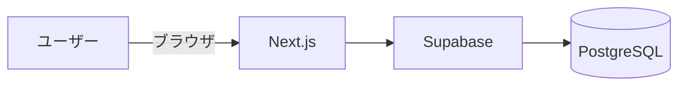
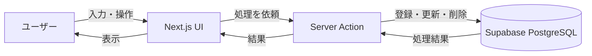
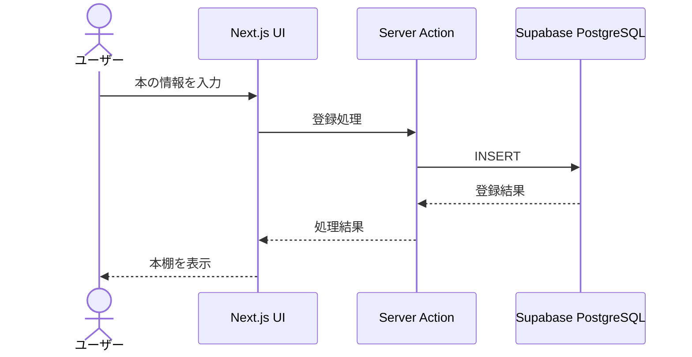
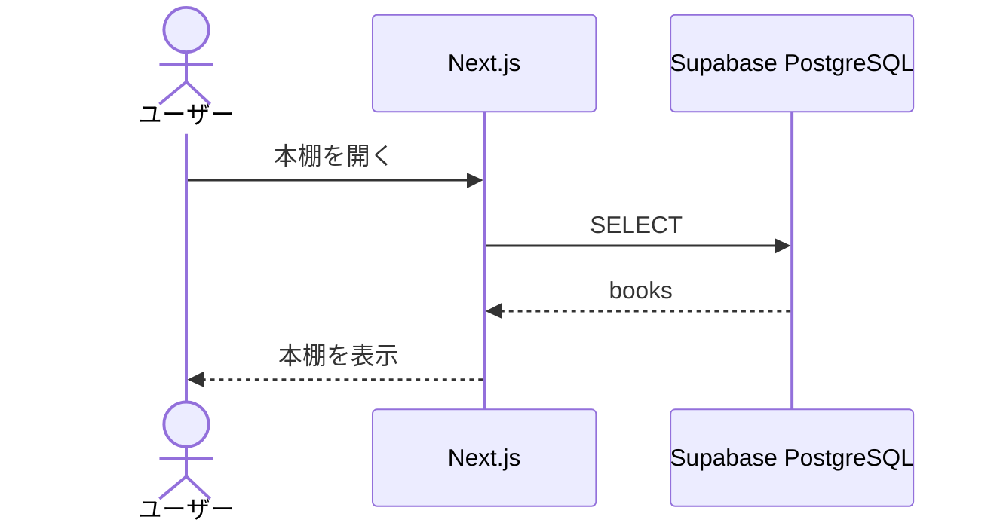
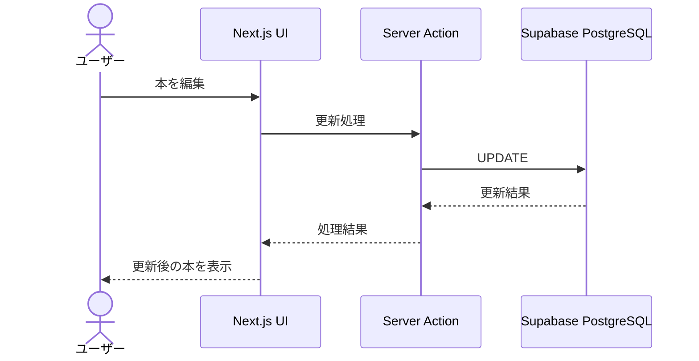
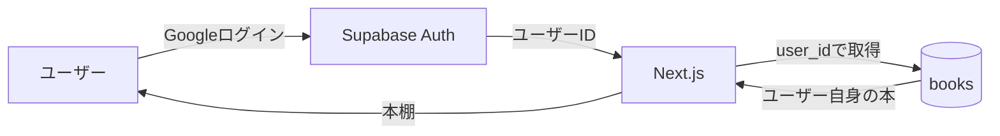
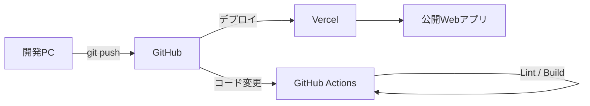

# システム構成設計

## 1. 基本方針

MVPでは、できるだけシンプルな構成を採用する。

独立したバックエンドサーバーなどは用意せず、
Next.jsとSupabaseを中心に構成する。

---

## 2. 使用技術

| 領域 | 技術 | 役割 |
|---|---|---|
| フロントエンド | Next.js | Webアプリの画面・処理 |
| UI | React | 画面を構成する |
| 言語 | TypeScript | 型安全な開発 |
| CSS | Tailwind CSS | UIのスタイリング |
| Backend | Next.js Server Actions | サーバー側の処理 |
| Database | Supabase PostgreSQL | 本のデータを保存 |
| Authentication | Supabase Auth | ユーザー認証 |
| Hosting | Vercel | Webアプリを公開 |
| CI/CD | GitHub Actions | 自動テスト・ビルドチェック |
| Version Control | Git / GitHub | ソースコード・設計管理 |

---

## 3. システム全体構成

アプリケーションの基本的な構成は以下の通り。

### 各要素の役割

- ユーザー：ブラウザからアプリを利用する
- Next.js：画面を表示し、アプリの処理を行う
- Supabase：認証とデータベースを提供する
- PostgreSQL：読書データを保存する

---

## 4. 各技術の役割

### Next.js

Webアプリケーション全体の基盤として使用する。

以下を担当する。

- ページ表示
- 画面遷移
- サーバー側処理
- データ取得
- データ更新

### React

Next.jsのUIを構築するために使用する。

本棚や本の一覧、入力フォームなど、
ユーザーが操作する画面をコンポーネントとして構築する。

### TypeScript

JavaScriptに型を追加して使用する。

本のデータなどの構造を明確にし、
実装時のミスを減らす。

### Tailwind CSS

画面のデザイン・レイアウトを実装する。

MVPではデザインを作り込みすぎず、
スマートフォンで使いやすいUIを優先する。

### Next.js Server Actions

サーバー側でデータを操作するために使用する。

例えば、

- 本の登録
- 本の編集
- 本の削除

などの処理を担当する。

### Supabase

バックエンドサービスとして使用する。

MVPでは主に以下を利用する。

- PostgreSQL
- Authentication

### Supabase PostgreSQL

読書記録を保存する。

MVPでは `books` テーブルを使用する。

### Supabase Auth

ユーザーの認証を担当する。

MVPではGoogleログインを使用する。

ログインしているユーザーのIDを取得し、
そのユーザー自身の本だけを操作できるようにする。

### Vercel

完成したNext.jsアプリをインターネット上に公開する。

GitHubと連携し、
コードを更新すると自動的にデプロイできる構成を目指す。

### GitHub Actions

GitHubにコードをpushした際に、
自動的にコードチェックを実行する。

MVPでは以下を実行する。

- Lint
- Build

### Git / GitHub

以下を管理する。

- ソースコード
- 設計ドキュメント
- 開発履歴

GitHub Issuesを使用して開発タスクも管理する。

---

## 5. 本のデータ操作

本の登録・編集・削除では、
Next.jsからSupabaseのデータベースを操作する。

### データ操作

| 操作 | DBで行う処理 |
|---|---|
| 本の登録 | INSERT |
| 本の一覧取得 | SELECT |
| 本の編集 | UPDATE |
| 本の削除 | DELETE |

---

## 6. 本の登録

本を登録するときは、以下の流れで処理する。

---

## 7. 本の一覧表示

本棚を開いたときは、Supabaseから本の一覧を取得する。

---

## 8. 本の編集

既存の本を編集する場合は、
新しいレコードを作成せず、既存のレコードを更新する。

---

## 9. 本の削除

本を削除する場合は、既存のレコードを削除する。

---

## 10. 認証とデータアクセス

ユーザーがGoogleログインすると、
Supabase Authによってユーザーが識別される。

本のデータには `user_id` を保存する。

これにより、ユーザーごとのデータを分離する。

MVPでは自分一人で使用するが、
将来的な複数ユーザー利用を考慮した構成とする。

---

## 11. デプロイ構成

開発したコードはGitHubで管理し、
GitHub Actionsで自動チェックを行う。

その後、Vercelにデプロイする。

### GitHub Actionsで行うチェック

- Lint
- Build

チェックに失敗した場合は、
問題を修正してから再度pushする。

---

## 12. MVPで採用しない構成

以下はMVPでは使用しない。

- 独立したバックエンドサーバー
- Docker
- Kubernetes
- Redis
- GraphQL
- 外部API
- マイクロサービス
- 複雑な状態管理ライブラリ

アプリの規模に対して過剰な構成になるため、
必要になった時点で導入を検討する。

---

## 13. 技術選定の方針

「最新だから」という理由ではなく、
以下を重視して技術を選定する。

- MVPを短期間で完成できる
- Webアプリ開発を幅広く経験できる
- 個人開発で運用しやすい
- 将来的な拡張が可能
- 学習効果が高い

---

## 14. 技術構成の考え方

### Next.js

アプリ本体を作る。

### Supabase

ログインとデータベースを担当する。

### Vercel

アプリをインターネット上に公開する。

### GitHub

ソースコードと設計資料を管理する。

### GitHub Actions

コードの自動チェックを行う。

---

## 15. 設計上の注意

Next.js Server Actionsを使用すること自体を目的としない。

実装時には、

- Server Componentで処理するもの
- Server Actionsで処理するもの
- Route Handlerが必要なもの

を、それぞれの用途に応じて判断する。

「Server Actionsを使う」ことよりも、
「Next.jsの仕組みを適切に使って安全かつシンプルに実装する」ことを優先する。